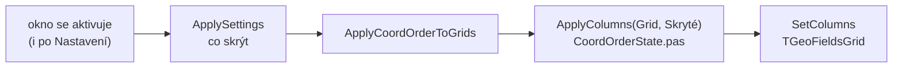

# TGeoFieldsGrid

Tabulka, jejíž sloupce jsou pole `TGeoRow` (CB, Y, X, HZ, SH…). Řádek
tabulky se dá přečíst do `TGeoRow` a zpět, každý sloupec kontroluje
zadávání podle svého pole. Používají ji všechna výpočetní okna.

## Sloupce

| vlastnost | co určuje |
|---|---|
| `ColumnFields` | které sloupce tabulka má a v jakém pořadí, jeden řádek `Pole=Popisek` na sloupec. Nastavuje se v Object Inspectoru. |
| `GeoFields` | množina polí, která jsou právě vidět. Tabulka bez `ColumnFields` z ní bere sloupce v pořadí výčtu. |
| `ReadOnlyFields` | pole, která plní program (výsledky). Tabulka jim dá do filtru `ReadOnly`, kurzor je přeskočí, kód do nich píše dál. |

Popisek bez `=` se vezme z katalogu polí (`GeoFieldInfo`
v `GeoRow.pas`). Desetinná místa pole nastaví `SetFieldDecimals`,
sloupec pole najde `FieldToCol`, pole sloupce `ColToField`.

## Filtry z katalogu

Při každé změně sloupců vyrobí tabulka filtry podle katalogu polí
(`ApplyFieldInfo`):

| druh pole | typ filtru | prázdná buňka | desetiny |
|---|---|---|---|
| `fkPointNumber` | celé číslo, až 15 číslic a znaménko | smí | – |
| `fkInteger` | celé číslo | dá 0 | – |
| `fkText` | text | zůstane | – |
| `fkNumber` | výraz | smí | podle katalogu |
| `fkResult` | číslo | smí | podle katalogu |

Meze, délka a perioda se převezmou z katalogu, `ReadOnly`
z `ReadOnlyFields`.

## Řádek tabulky a TGeoRow

| metoda | co dělá |
|---|---|
| `GetGeoRow(Řádek, Row)` | přečte řádek tabulky do `TGeoRow`, pole bez sloupce zůstanou prázdná (`ClearGeoRow`) |
| `SetGeoRow(Řádek, Row)` | zapíše zobrazená pole `TGeoRow` do řádku tabulky |
| `CheckGeoRow(Row)` | zkontroluje řádek jako při psaní, vrátí `''`, nebo „popisek = špatná hodnota“ |

## Skrytí sloupců a pořadí Y a X

`ColumnFields` je úplný seznam, sloupce se neodebírají. Co se nemá
ukázat, okno skryje funkcí `ApplyColumns(Grid, Skryté)`
z `CoordOrderState.pas`. Ta

1. vezme pořadí z `ColumnFields` bez skrytých polí,
2. seřadí dvojice Y a X a Ym a Xm podle Nastavení (`GCoordOrder`),
   a stejně i dvojici, kterou předá úloha, například transformace
   `ApplyColumns(Grid, [], M1, M2)` pro dY a dX,
3. předá pořadí tabulce (`SetColumns`). Tabulka sloupce přestaví
   a texty buněk nechá pod jejich poli, takže zadané hodnoty se
   neztratí.

Když se nic nezměnilo, tabulku nepřestavuje.


```mermaid
flowchart LR
  A["okno se aktivuje<br/>(i po Nastavení)"] --> B["ApplySettings<br/>co skrýt"]
  B --> C["ApplyCoordOrderToGrids"]
  C --> D["ApplyColumns(Grid, Skryté)<br/>CoordOrderState.pas"]
  D --> E["SetColumns<br/>TGeoFieldsGrid"]
```

Příklad z polární metody: co se skryje, určuje Nastavení.

```pascal
  Hidden := [];
  if not GSettings.Polar.Offset then
    Include(Hidden, Sta);
  if not GSettings.Polar.Perpendicular then
    Include(Hidden, Kol);
  // Horizontal length, or the slope one with its zenith angle
  if GSettings.Polar.SlopeLengths then
    Include(Hidden, SH)
  else
    Include(Hidden, SS);
  …
  ApplyColumns(GridOrientation, Hidden);
  ApplyColumns(GridDetail, Hidden);
```

Ostatní okna volají `ApplyColumns(Grid, [])`, nic neskrývají a jen
řadí Y a X.

## Na co dát pozor

- Sloupce se mění přes `SetColumns` (pole v pořadí). Texty buněk
  zůstanou pod svým polem, šířky sloupců zůstávají podle pozice.
- Nový sloupec se přidá do `ColumnFields` v návrháři, ne v kódu. Při
  ruční úpravě `.dfm` musí sedět `ColCount` a počet `ColWidths`.
- Seznam souřadnic používá jiný grid (`TGeoPointsGrid`) a pořadí Y a X
  řeší sám, viz [Pořadí souřadnic](../seznam-souradnic/poradi-souradnic.md).
