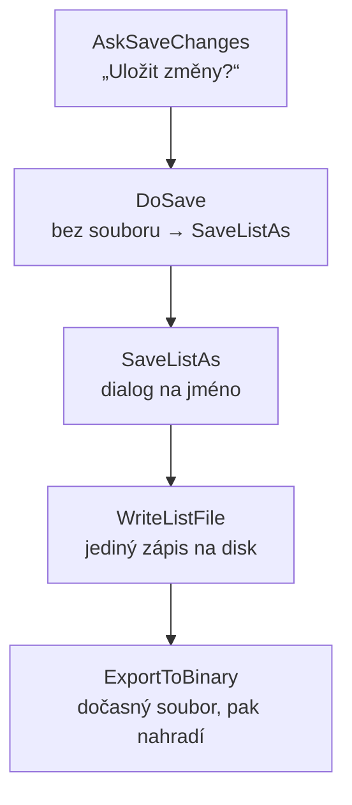
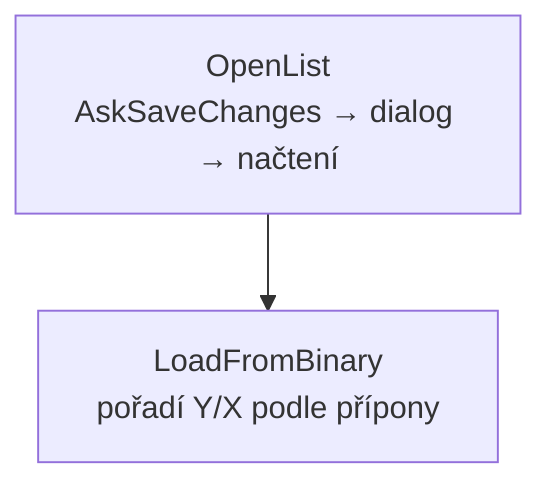
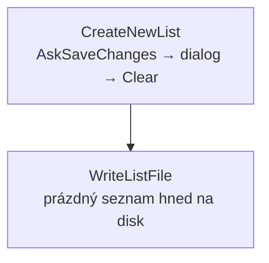
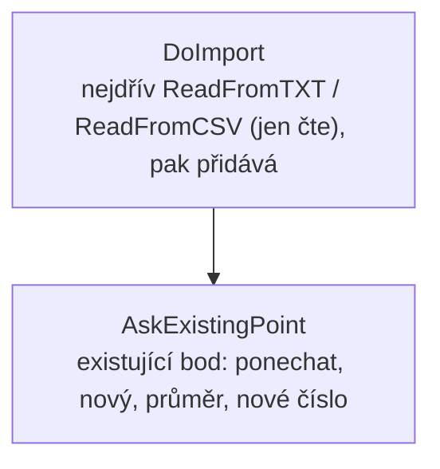
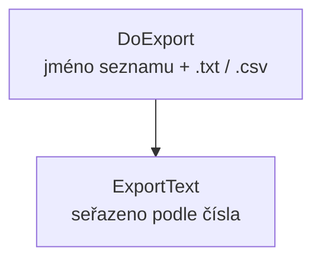
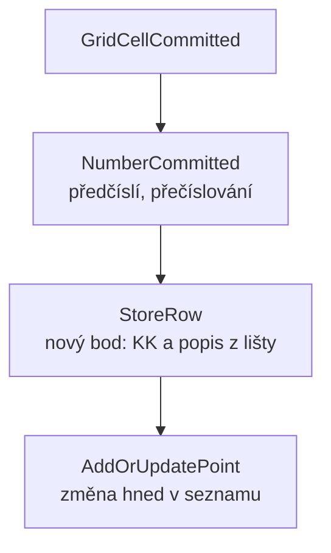
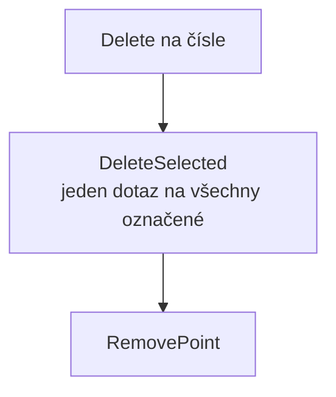
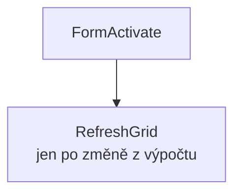

# Průběh volání

Šipka vede od procedury k proceduře, kterou volá.

## Ukládání

```mermaid
flowchart TB
  A["AskSaveChanges<br>„Uložit změny?“"] --> D["DoSave<br>bez souboru → SaveListAs"]
  D --> S["SaveListAs<br>dialog na jméno"]
  S --> W["WriteListFile<br>jediný zápis na disk"]
  W --> E["ExportToBinary<br>dočasný soubor, pak nahradí"]
```

## Otevření a nový seznam

```mermaid
flowchart TB
  O["OpenList<br>AskSaveChanges → dialog → načtení"] --> L["LoadFromBinary<br>pořadí Y/X podle přípony"]
```

```mermaid
flowchart TB
  N["CreateNewList<br>AskSaveChanges → dialog → Clear"] --> W["WriteListFile<br>prázdný seznam hned na disk"]
```

## Import a export

```mermaid
flowchart TB
  I["DoImport<br>nejdřív ReadFromTXT / ReadFromCSV (jen čte), pak přidává"] --> A["AskExistingPoint<br>existující bod: ponechat, nový, průměr, nové číslo"]
```

```mermaid
flowchart TB
  X["DoExport<br>jméno seznamu + .txt / .csv"] --> T["ExportText<br>seřazeno podle čísla"]
```

## Tabulka

```mermaid
flowchart TB
  G["GridCellCommitted"] --> N["NumberCommitted<br>předčíslí, přečíslování"]
  N --> S["StoreRow<br>nový bod: KK a popis z lišty"]
  S --> A["AddOrUpdatePoint<br>změna hned v seznamu"]
```

```mermaid
flowchart TB
  K["Delete na čísle"] --> D["DeleteSelected<br>jeden dotaz na všechny označené"]
  D --> R["RemovePoint"]
```

## Návrat do okna

```mermaid
flowchart TB
  F["FormActivate"] --> R["RefreshGrid<br>jen po změně z výpočtu"]
```
